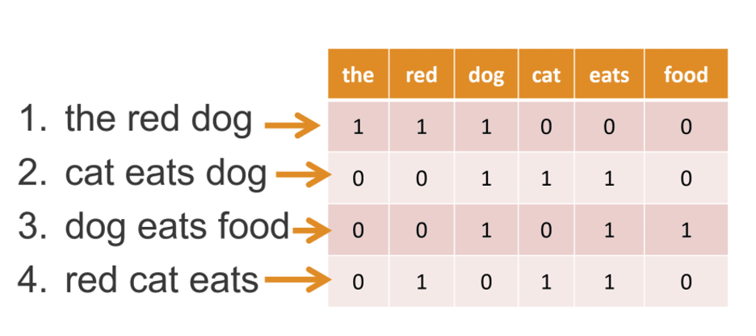
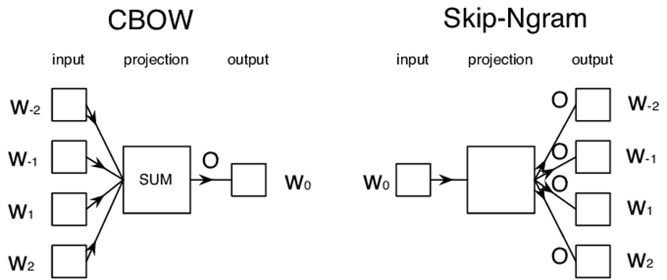
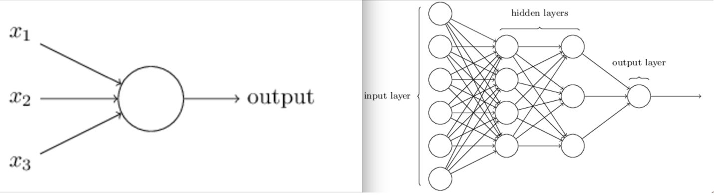
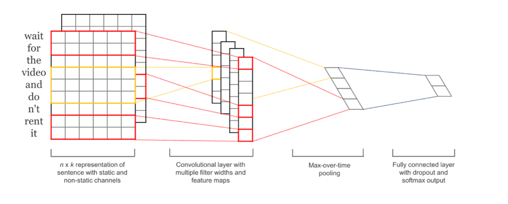
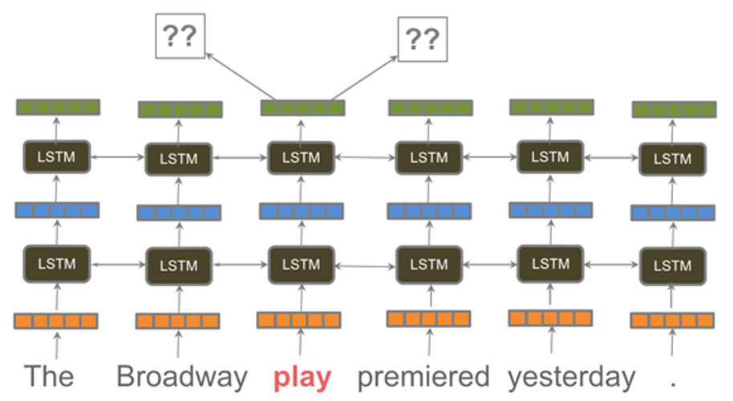

**Министерство науки и высшего образования Российской Федерации**

**Федеральное государственное автономное образовательное учреждение
высшего образования**

**«КАЗАНСКИЙ (ПРИВОЛЖСКИЙ) ФЕДЕРАЛЬНЫЙ УНИВЕРСИТЕТ»**

ИНСТИТУТ ВЫЧИСЛИТЕЛЬНОЙ МАТЕМАТИКИ И

ИНФОРМАЦИОННЫХ ТЕХНОЛОГИЙ

КАФЕДРА ТЕХНОЛОГИЙ ПРОГРАММИРОВАНИЯ

Направление: 09.03.03 -- «Прикладная информатика»

ВЫПУСКНАЯ КВАЛИФИКАЦИОННАЯ РАБОТА

**Разработка алгоритма обработки естественного языка при помощи
машинного обучения с использованием нейросетей BERT**

**Работа завершена:**

Студент 4 курса

группы 09-852

«\_\_\_»\_\_\_\_\_\_\_\_\_\_\_\_\_ 2022 г. \_\_\_\_\_\_\_\_\_\_\_\_
Саидмуродов С.С.

**Работа допущена к защите:**

Научный руководитель

старший преподаватель

«\_\_\_»\_\_\_\_\_\_\_\_\_\_\_\_\_ 2022 г. \_\_\_\_\_\_\_\_\_\_\_\_
Прокопьев Н.А.

Заведующий кафедрой

канд. экон. наук, доцент

«\_\_\_»\_\_\_\_\_\_\_\_\_\_\_\_\_ 2022 г. \_\_\_\_\_\_\_\_\_\_\_\_
Вахитов Г.З.

Казань -- 2022

# Оглавление {#оглавление .Title}

[Оглавление [2](#оглавление)](#оглавление)

[Введение [4](#введение)](#введение)

[1. Формирование требований
[7](#формирование-требований)](#формирование-требований)

[1.1. Изучение предметной области машинного обучения и нейронных сетей
[7](#изучение-предметной-области-машинного-обучения-и-нейронных-сетей)](#изучение-предметной-области-машинного-обучения-и-нейронных-сетей)

[1.2. Анализ подходов к обработке естественного языка
[8](#анализ-подходов-к-обработке-естественного-языка)](#анализ-подходов-к-обработке-естественного-языка)

[1.2.1. Традиционные языковые модели
[8](#традиционные-языковые-модели)](#традиционные-языковые-модели)

[1.2.2. Нейросетевые архитектуры
[11](#нейросетевые-архитектуры)](#нейросетевые-архитектуры)

[1.2.3. Модели на основе архитектуры Трансформер
[14](#модели-на-основе-архитектуры-трансформер)](#модели-на-основе-архитектуры-трансформер)

[1.3. Техническое задание
[14](#техническое-задание)](#техническое-задание)

[2. Проектирование платформы для обучения нейросетевой модели
[17](#проектирование-платформы-для-обучения-нейросетевой-модели)](#проектирование-платформы-для-обучения-нейросетевой-модели)

[2.1. Используемые модели нейронных сетей
[17](#используемые-модели-нейронных-сетей)](#используемые-модели-нейронных-сетей)

[2.2. Формализация алгоритмов основного анализа текста
[17](#формализация-алгоритмов-основного-анализа-текста)](#формализация-алгоритмов-основного-анализа-текста)

[2.3. Структура платформы для обучения нейросетевой модели
[17](#структура-платформы-для-обучения-нейросетевой-модели)](#структура-платформы-для-обучения-нейросетевой-модели)

[3. Экспериментальная реализация алгоритма анализа текста
[18](#экспериментальная-реализация-алгоритма-анализа-текста)](#экспериментальная-реализация-алгоритма-анализа-текста)

[3.1. Подготовка данных для обучения
[18](#подготовка-данных-для-обучения)](#подготовка-данных-для-обучения)

[3.2. Реализация платформы для обучения нейросетевой модели
[18](#реализация-платформы-для-обучения-нейросетевой-модели)](#реализация-платформы-для-обучения-нейросетевой-модели)

[3.3. Результаты машинного обучения
[18](#результаты-машинного-обучения)](#результаты-машинного-обучения)

[4. Тестирование по результатам обучения модели для основного анализа
текста
[19](#тестирование-по-результатам-обучения-модели-для-основного-анализа-текста)](#тестирование-по-результатам-обучения-модели-для-основного-анализа-текста)

[4.1. Экспериментальная оценка результатов обучения
[19](#экспериментальная-оценка-результатов-обучения)](#экспериментальная-оценка-результатов-обучения)

[4.2. Целевой оценочный тест реализации алгоритма
[19](#целевой-оценочный-тест-реализации-алгоритма)](#целевой-оценочный-тест-реализации-алгоритма)

[Заключение [20](#заключение)](#заключение)

[Список использованных источников [21](#_Toc101382011)](#_Toc101382011)

# Введение {#введение .Title}

Для понимания текста людьми и программами искусственного интеллекта (ИИ)
часто требуется правильное использование заглавных букв и знаков
препинания. Простые предложения, состоящие из нескольких слов, и люди, и
ИИ могут читать и обрабатывать, даже если использование заглавных букв
или знаков препинания отсутствует или неправильно. Например, в случае
голосовых команд обработка обычно выполняется только для распознанных
слов нижнего регистра. Однако, если объем текста, подлежащего анализу,
увеличивается, например, до целых абзацев или страниц, то даже для
человека быстрое понимание его смысла становится сложной задачей. Это
было изучено Джонсом и др. (2003), которые проанализировали влияние
заглавных букв и пунктуации на читаемость расшифровки речи в текст.

Ранние работы рассматривали пунктуацию только как подсказки с точки
зрения читателя к возможным просодическим характеристикам и паузам
текста (Markwardt, 1942). Нанберг (1990) утверждает, что пунктуация
играет гораздо большую роль. Кроме того, знаки препинания
классифицируются как разграничивающие, разделяющие и устраняющие
неоднозначность. Некоторые метки, такие как запятая, могут принадлежать
к нескольким категориям, поскольку они могут выполнять несколько ролей.
Джонс (1994) доказывает, что «для более длинных предложений реального
языка грамматика, использующая знаки препинания, значительно превосходит
аналогичную грамматику, которая их игнорирует». Основываясь на этом и
других подобных выводах, современные языковые модели считают пунктуацию
частью своего словарного запаса. Сюда входят новейшие модели, такие как
BERT, ELMo, OpenAI GPT-2 и GPT-3.

Алгоритмы обработки естественного языка (NLP -- Natural language
processing), такие как распознавание именованных сущностей (NER -- Named
entitiy recognition), идентификация части речи, анализ зависимостей,
машинный перевод (MT -- Machine translation), используют заглавные буквы
в качестве признаков обрабатываемого в данный момент слова, в то время
как пунктуация используется. как признаки для соседних слов. Например,
Stanford Named Entity Recognizer рассматривает признаки на основе формы
слова. Это означает построение представления слова на основе типа
символов, встречающихся в слове. Было предложено несколько алгоритмов
представления формы слова, но общая идея состоит в том, чтобы
закодировать прописную букву определенным символом, скажем, «X»,
строчную букву «x» и цифру «d». В этом случае слово типа «McDonald»
станет «ХхХхххх». Работа любых таких алгоритмов возможна только в том
случае, если слова правильно представлены в виде прописных и строчных
букв.

Особое внимание следует уделить системам автоматического распознавания
речи (ASR -- Automatiс speech recognition). Первичный вывод таких систем
обычно состоит из необработанного текста с использованием одного и того
же регистра (нижнего, либо верхнего регистра) и без знаков препинания. В
таких ситуациях перед применением дальнейших алгоритмов NLP требуется
дополнительная предварительная обработка, чтобы восстановить правильный
регистр букв и пунктуацию. Их иногда называют «богатыми транскрипциями».
Одна из первых инициатив, касающихся автоматической расширенной
транскрипции разговорной речи, началась в 2002 году в контексте
программы DARPA «Эффективное, доступное повторное использование речи в
текст» (EARS -- Effective, Affordable, Reusable Speech-to-text), целью
которой было улучшение уровня развития алгоритмов обработки языка. С
этой целью NIST (National institute of Standards and Technology)
выпустил серию обширных наборов данных для оценки транскрипции, чтобы
помочь в оценке таких систем.

Несмотря на то, что большой объем данных, требующих восстановления
заглавных букв и пунктуации, поступает из систем ASR, необходимо также
учитывать и другие источники. Миллер и др. (2000) идентифицируют другие
источники шума в виде текста, полученного с помощью оптического
распознавания символов (OCR), или в некоторых газетных статьях. В этих
случаях отсутствие надлежащей буквы или пунктуации затрагивает не весь
текст, а его части. В случае OCR некоторые знаки препинания могут быть
не распознаны, в то время как в случае некоторых статей первое
предложение или абзац могут быть написаны только заглавными буквами.
Кроме того, в случае коротких текстовых сообщений (SMS), чатов, твитов
или других действий в микроблогах люди также могут игнорировать
правильный регистр и пунктуацию.

Одна из трудностей, при создании человеко-компьютерных интерфейсов с
использованием естественного языка, с которыми приходится сталкиваться,
связана с непоследовательным использованием пользователем пунктуации и
использования заглавных букв. В этом контексте многие подходы пытаются
скрыть проблему, удаляя все знаки препинания и заглавные буквы как из
данных обучения, так и из входных данных, полученных во время работы.
Кроме того, Coniam (2014) также проанализировал вывод чат-ботов с точки
зрения человека, использующего эти программы для изучения английского
как второго языка. Он смог определить проблемы с заглавными буквами и
пунктуацией даже в произведенном тексте. Тем не менее, он утверждает,
что для коротких предложений, создаваемых чат-ботами, «переход на
английский язык за счет все более широкого распространения текстовых
сообщений делает спорным вопрос о том, можно ли считать эти проблемы
важными в наши дни».

# Формирование требований

## Изучение предметной области машинного обучения и нейронных сетей

Итак, разберемся что же такое машинное обучение. В Википедии можно найти
следующее определение: «Машинное обучение --- класс методов
искусственного интеллекта, характерной чертой которых является не прямое
решение задачи, а обучение за счёт применения решений множества сходных
задач». Так же можно найти более современное определение машинного
обучения, данное Томом Митчеллом: «A computer program is said to learn
from experience E with respect to some class of tasks T and performance
measure P if its performance at tasks in T, as measured by P, improves
with experience E». Различают два основных типа обучения:

-   Дедуктивное обучение, или обучение с учителем, предполагает
    формализацию знаний экспертов и их перенос в компьютер в виде базы
    знаний

-   Обучение по прецедентам, или индуктивное обучение (обучение без
    учителя), основано на выявлении эмпирических закономерностей в
    собранных данных.

В первом случае важна правильно составленная и размеченная обучающая
выборка данных. Для этого необходимо выделить важные признаки данных, и
заранее определить правильный ожидаемый результат для каждого набора
данных. Дедуктивное обучение принято относить к области экспертных
систем, поэтому иногда под машинным обучением понимают дедуктивное
обучение.

Второму случаю присуще обучение на основе неразмеченных данных, и целью
алгоритмов является определение признаков данных и их приоритетов.
Многие методы, применяемые в обучении без учителя тесно связаны с
извлечением информации и анализом данных.

Так как машинное обучение является достаточно крупной областью науки,
далее более детально будут рассмотрены только подходы к обработке
естественного языка, подробнее с машинным обучением можно ознакомится в
приведенных источниках.

## Анализ подходов к обработке естественного языка

В данной работе рассмотрим подходы, основанные на машинном обучении.
Далее будут коротко описаны методы решения задач обработки естественного
языка с применением таких технологий как BoW, TF-IDF, Word2Vec, GloVe,
fastText, GRU, LSTM, BERT и ELMO.

### Традиционные языковые модели

#### BoW

*BoW* (от англ. Bag of words -- мешок слов) является наиболее простым и
часто встречающимся векторным представлением. BoW работает следующим
образом: на вход подается анализируемый текст, для каждого предложения
строится вектор с длиной n-элементов, где n -- это количество уникальных
токенов в тексте. Каждый элемент вектора хранит в себе частоту вхождения
того или иного токена в предложении. Токеном может являться как слово,
так и n-грамма.

{width="6.496527777777778in"
height="2.886111111111111in"}

Рисунок 1. Пример векторного представления текста по методике BoW, при
этом исполуется 3-граммная модель

Представления BoW часто используются в методах классификации документов,
где частота каждого слова, двухсловного или трехсловного слова является
полезной функцией для обучения классификаторов. Одна из проблем с
представлениями мешка слов заключается в том, что они не кодируют
никакой информации относительно значения данного слова. В BoW вхождения
слов имеют одинаковый вес независимо от того, как часто и в каком
контексте они встречаются. Однако в большинстве задач NLP одни слова
более важны, чем другие.

#### TF-IDF

*TF-IDF* (от англ. TF --- term frequency, IDF --- inverse document
frequency) --- статистическая мера, которая используется для оценки
значимости слова в контексте документа, являющегося частью коллекции
документов или корпуса. Вес некоторого слова пропорционален частоте
употребления этого слова в документе и обратно пропорционален частоте
употребления слова во всех документах коллекции. Мера TF-IDF находится
путем перемножения частоты слова в документе и обратной частоты слова в
корпусе документов:

$$\text{tf-idf}(t,d,D) = \text{tf}(t,d) \times \text{idf}(t,D)$$

Для нахождения частоты слова используют следующую формулу:

$$\text{tf}(t,d) = \frac{n_{t}}{\sum_{k}^{}n_{k}}$$

где $n_{t}$ -- число вхождений слова $t$ в документ, а знаменатель --
общее число слов в документе. Обратная частота документа -- инверсия
частоты, с которой некоторое слово встречается в документах коллекции
находится следующей формулой:

$$\text{idf}(t,D) = \log\frac{|D|}{\left| \text{\{}\, d_{i} \in D\mid t \in d_{i}\,\text{\}} \right|}$$

где $|D|$ -- число документов,
$\left| \text{\{}\, d_{i} \in D\mid t \in d_{i}\,\text{\}} \right|$ --
число документов из коллекции $D$, в которых встречается слово $t$
(когда $n_{t} \neq 0$)

#### Word2Vec

*Word2Vec* -- совокупность моделей на основе нейронных сетей,
используемых для получения векторных представлений слов. Используется
для изучения семантики естественных языков. Word2Vec разработан
исследовательской группой Google под руководством чешского ученого
Томаса Миколова в 2013 году. Word2Vec включается в себя две архитектуры
моделей: Continuous bag-of-words (CBOW) для предсказания слова наиболее
подходящего для данного контекста (при этом порядок слов не важен как и
в BoW) и Continuous skip-gram используется для получения набора схожих
слов со входящим словом

{width="6.496527777777778in"
height="2.7305555555555556in"}

Рисунок 2. Наглядное сравнение архитектур Word2Vec

#### GloVe

GloVe (от англ. Global Vectors -- глобальные векторы) -- еще одна
языковая модель, основанная на индуктивном обучении. В этой модели слова
отображаются в векторном пространстве, где расстояние между словами
определяет их семантическое сходство. GloVe создавался как проект с
открытым исходным кодом в Стэнфорде в 2014 году. Эту модель можно
использовать для поиска взаимосвязей между такими словами, такими как
синонимы, отношения между компанией и продуктом, почтовые индексы и
города и т. д. Хотя векторы GloVe быстрее обучаются, ни GloVe, ни
Word2Vec, как показала практика, не дают однозначно лучших результатов,
при тестировании на одних и тех же наборах данных.

#### fastText

fastText -- это библиотека обучения моделей векторных представлений и
классификации текста разработанная командой исследователей Facebook в
2018 году. fastText создан на основе Word2Vec путем обучения векторных
представлений для каждого слова и n-грамм, найденных в каждом слове.
Значения представлений усредняются в один вектор на каждом шаге
обучения. Хотя такой подход добавляет много дополнительных вычислений к
обучению, это позволяет векторным представлениям слов кодировать
информацию о подсловах. Было показано, что векторы FastText более точны,
чем векторы Word2Vec, по ряду различных показателей. На сегодняшний день
Facebook предоставляет предварительно обученные модели для 294 языков.

### Нейросетевые архитектуры

В дополнение к лучшему представлению векторов слов появление нейронных
сетей привело к достижениям в архитектуре машинного обучения, которые
сделали возможными решения таких проблем как нахождение
референционального тождества, анализ тональности текста, распознавание
именованных сущностей, классификация намерений и так далее. В этом
разделе коротко опишем существующие нейросетевые архитектуры.

#### Нейронные сети с прямой связью

Появление линейных сетей с прямой связью, также известных как
многослойные персептроны (Multi-layer perceptrons - MLP) в NLP, открыло
возможности для нелинейного моделирования. Эта разработка помогает с
НЛП, потому что бывают случаи, когда пространство встраивания может быть
нелинейным.

{width="6.496527777777778in" height="1.75625in"}

Рисунок 3. Схема архитектуры MLP

Однако это развитие само по себе не привело к существенной революции в
NLP, поскольку MLP не могут моделировать порядок слов. В то же время как
MLP открывают двери для незначительных улучшений в таких задачах, как
классификация языков, где решения могут приниматься путем моделирования
независимых частот символов, но для более сложных или неоднозначных
задач автономные MLP не подходят.

#### Сверточные нейронные сети

Сверточные нейронные сети (Convolutional neural networks -- CNN) пришли
в NLP из компьютерного зрения. В NLP вместо свертки по пикселям
сверточные фильтры применяются к группам векторов слов. В NLP CNN могут
моделировать порядок слов, именно благодаря этой особенности они
значительно улучшили решение задач классификации.

{width="5.68799978127734in"
height="2.291616360454943in"}

Рисунок 4. Сверточная нейронная сеть для классификации предложений

#### Рекуррентные нейросети

Опираясь на локальное упорядочение, обеспечиваемое CNN, рекуррентные
нейронные сети (RNN) и их варианты с закрытыми ячейками, такие как
ячейки долговременной памяти (Long Short Term Memory Cells -- LSTM) и
закрытые рекуррентные единицы (Gated Recurrent Units -- GRU),
предоставляют механизмы для моделирования последовательного упорядочения
и средних зависимостей в тексте, таких как влияние слова в начале
предложения на конец предложения.

Несмотря на то, что стандартные архитектуры RNN привели к невероятным
прорывам в области обработки естественного языка, они сталкиваются с
множеством проблем. Хотя теоретически они могут фиксировать долгосрочные
зависимости, они, как правило, испытывают трудности при моделировании
более длинных последовательностей, что все еще остается нерешенной
проблемой. Одной из причин неоптимальной производительности стандартных
моделей кодера-декодера RNN для задач на последовательности, таких как
NER или перевод, является то, что они равномерно взвешивают влияние
каждого входного вектора на каждый выходной вектор, когда в
действительности конкретные слова во входной последовательности могут
иметь большее значение на разных временных шагах. Механизмы внимания
обеспечивают средства взвешивания контекстуального воздействия каждого
входного вектора на каждое выходное предсказание RNN. Эти механизмы
отвечают за большую часть текущего или почти современного состояния
обработки естественного языка. Механизм копирования --- это
дополнительный уровень, применяемый во время декодирования, который
решает, лучше ли генерировать следующее слово из исходного предложения
или из общего словаря встраивания.

#### ELMo

ELMo (от англ. Embeddings from Language Model -- Векторные представления
из языковой модели) - это модель, которая генерирует вложения для слова
на основе контекста, в котором оно появляется, таким образом генерируя
несколько разные вложения для каждого его появления.

{width="6.338462379702537in"
height="3.4744663167104113in"}

Рисунок 5. Пример работы ELMo

Например, слово «play» в предложении на Рисунке 5, будет закодировано
ELMo как глагол «играть» и как существительное «спектакль», то есть
получим два разных представления. В стандартных вложениях слов, таких
как GloVe, FastText или Word2Vec, каждый экземпляр игры слов будет иметь
одинаковое представление. На основе ELMo была разработана архитектура
BERT.

### Модели на основе архитектуры Трансформер

По аналогии с рекуррентными нейронными сетями (РНС) трансформеры
предназначены для обработки последовательностей, таких как текст на
естественном языке, и решения таких задач как машинный перевод и
автоматическое реферирование. В отличие от РНС, трансформеры не требуют
обработки последовательностей по порядку. Например, если входные данные
--- это текст, то трансформеру не требуется обрабатывать конец текста
после обработки его начала. Благодаря этому трансформеры
распараллеливаются легче чем РНС и могут быть быстрее обучены.

{width="6.496527777777778in"
height="1.7979166666666666in"}

Рисунок 6. График появления новейших моделей на основе архитектуры
Трансформер

Архитектура Трансформер была представлена ​​в июне 2017 года. Основное
внимание в первоначальном исследовании уделялось задачам перевода. За
этим последовало введение нескольких влиятельных моделей, в том числе:

1.  GPT, первая предварительно обученная модель Трансформер,
    использовалась для тонкой настройки различных задач NLP и дала самые
    современные результаты.

2.  BERT, еще одна большая предварительно обученная модель,
    предназначенная для создания более качественных сводок предложений

3.  DistilBERT, оптимизированная версия BERT, которая на 60 % быстрее,
    на 40 % меньше памяти и при этом сохраняет 97 % производительности
    BERT.

4.  BART и T5, две большие предварительно обученные модели, использующие
    ту же архитектуру, что и исходная модель Трансформер

5.  GPT-3, более крупная версия GPT-2, способная хорошо выполнять
    различные задачи без необходимости точной настройки (так называемое
    обучение с нулевым выстрелом).

Этот список далеко не исчерпывающий, и он предназначен только для того,
чтобы выделить несколько значимых моделей Трансформеров. В целом их
можно разделить на три категории:

1.  GPT-подобные (также называемые авторегрессивными моделями
    Трансформер, auto-regressive)

2.  BERT-подобные (также называемые моделями Трансформер с
    автоматическим кодированием, auto-encoding)

3.  Подобные BART/T5 (также называемые моделями преобразования
    последовательности в последовательность, sequence-to-sequence)

## Техническое задание

Ранее было сказано, что пунктуация и капитализация в тексте являются
важными для понимания и дальнейшей обработки. Целью данной работы будет
разработка алгоритма для восстановления пунктуации и капитализации для
татарского и русского языков.

Разрабатываема система должна удовлетворять следующим принципам
проектирования информационных систем:

1.  Принцип системности - Подход к исследуемому объекту как единому
    целому. Это позволяет выявить многообразие типов связей между
    структурными элементами, обеспечивающими целостность системы.
    Системный подход предполагает проведение двухаспектного анализа
    (макро- и микроподходов). При макроанализе система и ее элемент
    рассматривается как часть системы более высокого порядка. При
    микроанализе изучается структура объекта, анализируются ее
    составляющие элементы с точки зрения их функциональных
    характеристик, проявляющихся через связи с другими элементами и
    внешней средой.

2.  Принцип совместимости, который заключается в обеспечении
    взаимодействия ИС различных видов, назначений, уровней в процессе
    функционирования.

3.  Принцип стандартизации и унификации, который заключается в
    необходимости применения типовых, унифицированных и
    стандартизованных элементов функционирования ИС. Это прежде всего
    относится к составляющим информационного, технического, программного
    и других обеспечительных подсистем. Этот принцип позволяет сократить
    временные, трудовые и стоимостные затраты на создание ИС при
    максимально возможном использовании накопленного опыта в
    формировании проектных решений и внедрении автоматизации
    проектировочных работ, обеспечивает многоаспектную взаимодействие
    ИС.

4.  Принцип декомпозиции, который основан на разделении системы на части
    и выделении отдельных комплексов работ, создает условия для более
    эффективного анализа существующего состояния управленческой
    деятельности, изучение особенностей решения функциональных задач для
    дальнейшего моделирования конкретных аспектов управленческой
    деятельности и перевода их на автоматизированную технологию.

Здесь же попробуем декомпозировать разрабатываемую систему, ее можно
поделить на несколько модулей:

1.  Модуль чтения данных, который необходим для загрузки,
    предварительной обработки, разметки, а также разделения данных на
    обучающие и тестовые выборки.

2.  Модуль токенизатор, будет переводить текст в токены

3.  Модуль обучения нейросети, в которой будут определения архитектуры
    нейросети и процесса ее обучения.

4.  Модуль тестирования, необходимый для получения объективной
    математической оценки работы обученной модели.

Для обучения и использования модели необходимо вычислительное устройство
(как клиентское, так и серверное). С учетом используемых библиотек и
технологий, к нему предъявляются следующие требования:

1.  ЦПУ с поддержкой пакета инструкций AVX (процессоры Intel®: линейки
    Core i3, i5, i7 и i9 второго поколения и новее либо процессор
    линейки Xeon; процессоры AMD®: семейства Jaguar и новее)

2.  Графический процессор Nvidia® с поддержкой технологии CUDA
    (семейства видеокарт RTX, Quadro, TITAN, Tesla)

3.  Операционная система: желательно Ubuntu 18.04 и новее (лучше
    использовать LTS сборки), macOS 10.12 Sierra и новее, Windows 10 и
    новее

4.  Оперативная память 8 ГБ и больше

5.  Минимальное место в накопителе данных: 50 ГБ (при условии обучения
    модели)

# Проектирование платформы для обучения нейросетевой модели

Asdada

## Используемые модели нейронных сетей

Asdada

## Формализация алгоритмов основного анализа текста

фвфвф

## Структура платформы для обучения нейросетевой модели

Текст рыба

# Экспериментальная реализация алгоритма анализа текста

Текст рыба

## Подготовка данных для обучения

Текст рыба

## Реализация платформы для обучения нейросетевой модели

Текст рыба

## Результаты машинного обучения

рыыыба

# Тестирование по результатам обучения модели для основного анализа текста

Рыба

## Экспериментальная оценка результатов обучения

Рыба

## Целевой оценочный тест реализации алгоритма

# Заключение {#заключение .Title}

Рыба

# Список использованных источников {#список-использованных-источников .list-paragraph}

**Jer Thomas Wolf and Lysandre Debut and Victor Sanh and Julien Chaumond
and Clement Delangue and Anthony Moi and Pierric Cistac and Tim Rault
and Rémi Louf and Morgan Funtowicz and Joe Davison and Sam Shleifer and
Patrick von Platen and Clara Ma and Yacine** Transformers:
State-of-the-Art Natural Language Processing \[Книга\]. - \[б.м.\] :
Association for Computational Linguistics, 2020. - стр. 38-45.

**Mitchell Tom M.** Machine Learning \[Книга\]. - \[б.м.\] : McGraw
Hill, 1997. - стр. 2.

**Păiş Vasile и Tufis Dan** Capitalization and Punctuation Restoration:
a Survey \[В Интернете\] // ResearchGate. - ResearchGate, 21 ноябрь 2021
г.. - 15 январь 2022 г.. -
https://www.researchgate.net/publication/356456267_Capitalization_and_Punctuation_Restoration_a\_Survey.

Машинное обучение \[В Интернете\] // Википедия. Свободная
энциклопедия.. - 23 январь 2022 г.. - 13 февраль 2022 г.. -
https://ru.wikipedia.org/wiki/Машинное_обучение.
